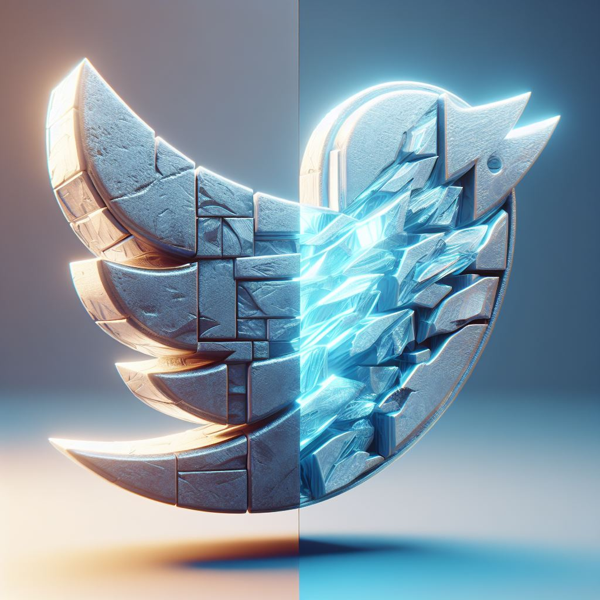

# twitter_clone

<p align="center"> 
  <a href="https://fullcycle.com.br/" target="_blank">
    
  </a> 
</p>

<h4 align="center" >🚀 🟦 Twitter - X 🟦 🚀</h4>

<h4 align="center">
  Application developed for explore my dev skills and make a discovery in the twitter platform by creating a clone that goes beyond the interface
</h4>

#

<p align="center">
  |&nbsp;&nbsp;
  <a style="color: #8a4af3;" href="#project">Overview</a>&nbsp;&nbsp;&nbsp;|&nbsp;&nbsp;&nbsp;
  <a style="color: #8a4af3;" href="#techs">Technologies</a>&nbsp;&nbsp;&nbsp;|&nbsp;&nbsp;&nbsp;
  <a style="color: #8a4af3;" href="#app">Project</a>&nbsp;&nbsp;&nbsp;|&nbsp;&nbsp;
  <a style="color: #8a4af3;" href="#run-project">Run</a>&nbsp;&nbsp;&nbsp;|&nbsp;&nbsp;
  <a style="color: #8a4af3;" href="#author">Author</a>&nbsp;&nbsp;&nbsp;|&nbsp;&nbsp;&nbsp;
</p>

#

<h1 align="center">
  
  <a href="https://github.com/Samuel-Ricardo">
    
  </a>

  <a herf="https://www.instagram.com/samuel_ricardo.ex/">
     
  </a>

  <a herf='https://www.linkedin.com/in/samuel-ricardo/'>
     
  </a>

</h1>

<br>

<p id="project"/>

<br>

<h2>  | :artificial_satellite: About:  </h2>

<p align="justify">
  This project is a functional twitter clone Full Stack application with a rethink metalic design, implements the main features of Twitter with the best pratice of Clean Architeture and with a Modular system, has the complete testing pyramid, security layer and more. The entire system is built on Docker.
</p>

<br>

🔭 | API Repository: [[twitter_clone-API](https://github.com/Samuel-Ricardo/twitter_clone-api)]
📡 | Hosted on Vercel: https://twitter-clone-gules-seven.vercel.app/

<br>

#

<br>

<h2 id="techs">
  :building_construction: | Technologies and Concepts Studied:
</h2>

> <a href='https://nextjs.org/'>  </a>

- NextJS 14
- TailwindCSS
- Typescript
- Jest
- Cypress
- Docker
- Inversify
- MongoDB
- NextAuth
- Zod
- Validations
- Zustand
- React-Hook-Forms
- File Upload & File Handle
- SWR
- React-Query - [ @tanstack ]
- Cryptography
- Argon2
- Bcrypt
- Crypto - [ NodeJS ]
- Axios
- Socket.IO
- Websockets
- eslint
- Prettier
- husky
- lint-staged
- Events & Async
- Event-Emitter 2
- Storybook - [ DOCS ]
- Analytics - [ Vercel ]
- Design Patterns
- Perfomance
- Clean Architeture
- Clean Code / SOLID
- Scalability
- Real Time

> Among Others...

#

<br>

<h2 id="app">
  💻 | Application:
</h2>

<h2 id="run-project"> 
   👨‍💻 | How to use
</h2>

<br>

### Open your Git Terminal and clone this repository

```git
  $ git clone "git@github.com:Samuel-Ricardo/twitter_clone.git"
```

### Make Pull

```git
  $ git pull "git@github.com:Samuel-Ricardo/twitter_clone.git"
```

<br>

This application use `Docker` so you dont need to install and cofigurate anything other than docker on your machine.

> <a target="_blank" href="https://www.docker.com/">  </a>

<br>

Navigate to project folder `$ cd ./twitter_clone/` and run it using `docker-compose`

```bash

  # After setup docker environment just run this commmand on root project folder:

  $ docker-compose up --build   # For First Time run this command

  $ docker-compose up           # to run project


```

```bash

  #Apps Running on:

  $ APP: http://localhost:3000

  $ STORYBOOK: http://localhost:6006/ [DOCUMENTATION] [DEV]


  $ [DEV] = only on development environment

  See more: ./twitter_clone/docker-compose.yaml

```

<br>

#

<br>

<h2 id="author">
  :octocat: | Author:  
</h2>

> <a target="_blank" href="https://www.linkedin.com/in/samuel-ricardo/">  <br> <p> <b> - Samuel Ricardo</b> </p></a>

<h1>
  <a herf='https://github.com/Samuel-Ricardo'>
     
  </a>
  
  <a herf='https://www.instagram.com/samuel_ricardo.ex/'>
     
  </a>
  
  <a herf='https://twitter.com/SamuelR84144340'>
     
  </a>
  
   <a herf='https://www.linkedin.com/in/samuel-ricardo/'>
     
  </a>
</h1>
